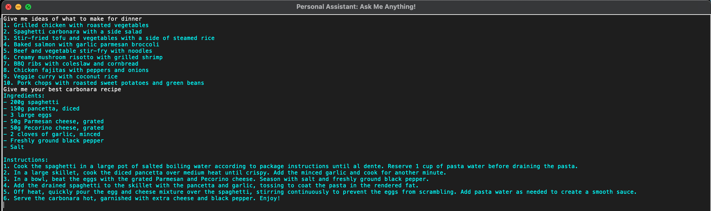

# Personal Assistant

A personal asssistant using Openai and Tkinter.
This application allows the user to ask any question and get a response. The user's query is answered by Chat GPT 3.5 Turbo API and is displayed on a Tkinter window.
 
